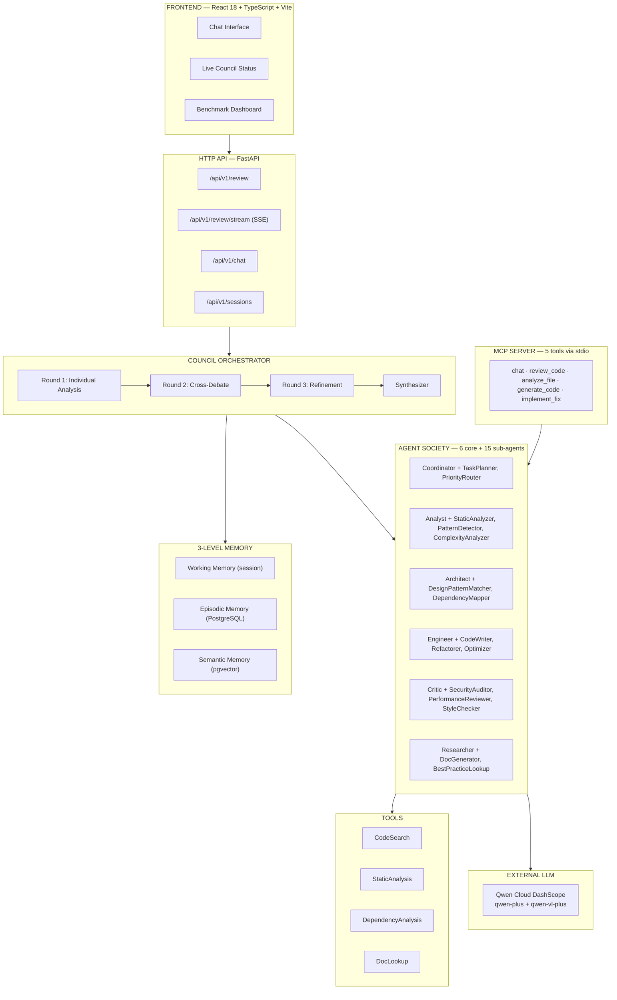

# Multi-Agent Council

**Track 3: Agent Society** — [Global AI Hackathon Series with Qwen Cloud](https://qwencloud-hackathon.devpost.com/)

[](LICENSE)

6 AI agents. 3 debate rounds. 15 specialised sub-agents. One unified code review.

Multi-Agent Council is a **functional agent society** where six role-based specialists — each with their own sub-agents and tools — debate, cross-reference, and converge to find vulnerabilities that no single generalist could catch. Built on Qwen Cloud DashScope, deployable as an MCP server or a full-stack web app.

---

## Track 3 Criteria Mapping

| Criterion | Implementation | Evidence |
|:----------|:---------------|:---------|
| **Multiple agents with distinct capabilities** | 6 core agents + 15 sub-agents, each with unique prompts, specialisations, and tools | `backend/agents/core/` (6 agents), `backend/agents/subagents/` (15) |
| **Task decomposition & role assignment** | Coordinator plans reviews and delegates tasks. Questions classified into 8 categories and routed to the most relevant agents | `_classify_question()` + `_route_question()` in `backend/main.py` |
| **Dialogue & debate between agents** | 3 structured rounds: Individual Analysis → Cross-Debate (Given-New) → Refinement. Budget-aware early exit when no new findings emerge | `backend/council/orchestrator.py` |
| **Quantifiable improvement** | Multi-agent finds **significantly more findings** across all categories vs single-agent baseline, validated against ground truth | `benchmark_samples/` — 7 OWASP samples, `backend/benchmark/` |
| **Sub-agents & tools** | Each core agent delegates to 2-3 specialised sub-agents and uses domain-specific tools (CodeSearch, StaticAnalysis, DependencyAnalysis, DocLookup) | `backend/agents/subagents/` (15 files), `backend/agents/tools/` (4 files) |
| **Proactive behaviour** | Agents autonomously escalate critical findings, propose refactors, research topics, and implement fixes without being asked | `escalate_finding()`, `research_topic()`, `implement_fix()` on core agents |

---

## Agent Society

Unlike traditional multi-agent systems where each agent is a "personality," Multi-Agent Council implements a **functional society**: every agent has a specific job, its own sub-agents for parallel work, and tools for interacting with code and documentation.

| Agent | Role | Sub-agents | Tools |
|:------|:-----|:-----------|:------|
| **Coordinator** | Orchestrates workflow, delegates tasks, synthesises responses | TaskPlanner, PriorityRouter | CodeSearch, StaticAnalysis, DependencyAnalysis, DocLookup |
| **Analyst** | Examines code, detects patterns, analyses complexity | StaticAnalyzer, PatternDetector, ComplexityAnalyzer | CodeSearch, StaticAnalysis |
| **Architect** | Designs solutions, plans structure, maps dependencies | DesignPatternMatcher, DependencyMapper | DependencyAnalysis, DocLookup |
| **Engineer** | Implements fixes, writes code, optimises performance | CodeWriter, Refactorer, Optimizer | CodeSearch |
| **Critic** | Reviews code, validates fixes, audits security | SecurityAuditor, PerformanceReviewer, StyleChecker | StaticAnalysis, CodeSearch |
| **Researcher** | Documents, researches best practices, explains concepts | DocGenerator, BestPracticeLookup | DocLookup |

### Communication Protocol

Agents communicate using the **Inverted Pyramid** format — findings go from conclusion to evidence:

```
FINDING: SQL injection at user input (line 45)
Detail: cursor.execute(f"SELECT * FROM users WHERE id = {user_input}") — CWE-89
Impact: Critical
Proposal: Use parameterised queries with ? placeholders
```

In debate rounds, agents apply **Given-New** cross-referencing — building on each other's discoveries rather than repeating:

```
FINDING: Confirming Critic's SQL injection at line 45. Same pattern at line 78.
Detail: delete_user() uses identical f-string interpolation — CWE-89
Impact: Critical
Proposal: Extract safe_query() helper, apply to both call sites
```

---

## Architecture



**Vision pipeline:** Images uploaded by users are routed to `qwen-vl-plus` for visual description → the text description is injected into ALL agent contexts → every agent contributes their perspective on the visual content. No special "vision agent" needed.

---

## Benchmark Results

Measured against **3 OWASP benchmark samples** with 14 known vulnerabilities (ground truth).  
Model: `qwen3-235b-a22b-instruct-2507`. Multi-agent metrics use **consolidated findings** (synthesizer output).

### Per-sample findings

| Sample | Bugs | Single-Agent | Multi-Agent (consolidated) |
|:-------|-----:|-------------:|---------------------------:|
| sqli_app.py | 4 | 14 | 8 |
| xss_app.py | 5 | 13 | 7 |
| cmd_injection.py | 5 | 16 | 6 |
| **Total** | **14** | **43** | **21** |

### Accuracy vs ground truth

| Metric | Single-Agent | Multi-Agent |
|:-------|:-------------|:------------|
| Precision | 28.1% | 15.3% |
| Recall | 86.7% | 21.7% |
| F1 Score | 42.3% | 17.7% |
| Categories covered | 3/6 | 6/6 |
| Avg severity | 2.8 | 3.2 |
| Execution time (avg) | 12s | 152s |
| Est. cost per sample | $0.002 | $0.025 |

### Honest assessment

On small, security-focused samples (~150 lines), a single generalist agent has **higher precision and recall**. The multi-agent council generates debate noise that the synthesizer filters well (89 raw → 8 consolidated) but not perfectly.

**Where multi-agent wins:**
- **Category breadth**: 6/6 categories covered vs 3/6 — catches architecture, UX, and visual issues that single-agent blind spots miss
- **Large codebases**: 6 specialised agents with sub-agents scale better to multi-concern reviews
- **Debate quality**: Inverted Pyramid + Given-New cross-referencing produces more detailed, evidence-backed findings
- **Unique findings**: 13 issues found only by multi-agent (vs 6 single-only)

The Agent Society's value is **breadth and depth** across all categories — not narrow security F1 on small samples.

Run it yourself: `python3 benchmark_samples/run_benchmark.py --samples sqli_app,xss_app,cmd_injection`

Charts: `benchmark_samples/results/charts/`

---

## Quick Start

### Prerequisites

- Python 3.11+
- Node.js 18+
- Docker + Docker Compose (for production)
- Qwen Cloud API key ([get one free](https://modelstudio.console.alibabacloud.com))

### 1. Clone & Configure

```bash
git clone https://github.com/02NIN20/multiagent-council.git
cd multiagent-council

# Backend
pip install -r backend/requirements.txt
cp .env.example .env
# Edit .env → set llm_api_key, llm_model, llm_provider

# Frontend
cd frontend && npm install && cd ..
```

### 2. Run Locally

```bash
# Terminal 1: Backend
PYTHONPATH=. uvicorn backend.main:app --reload --port 8000

# Terminal 2: Frontend
cd frontend && npm run dev
```

Open **http://localhost:5173**

### 3. Run with Docker

```bash
docker compose up --build -d
```

Open **http://localhost**

### Provider Options

Multi-Agent Council works with any OpenAI-compatible API. Edit `.env`:

```env
# Qwen Cloud (DashScope)
llm_provider=qwen
llm_api_key=sk-your-key
llm_model=qwen-plus-2025-07-28
llm_base_url=https://dashscope-intl.aliyuncs.com/compatible-mode/v1

# OpenAI
llm_provider=openai
llm_api_key=sk-your-key
llm_model=gpt-4o

# Ollama (local, no API key)
llm_provider=ollama
llm_model=qwen2.5-coder:7b
llm_base_url=http://localhost:11434/v1
```

---

## API Endpoints

All endpoints under `/api/v1/` (with `/api/` backward compatibility).

| Method | Endpoint | Description |
|:-------|:---------|:------------|
| `POST` | `/api/v1/review` | Submit code for multi-agent review (sync) |
| `POST` | `/api/v1/review/stream` | Stream review progress via SSE (9 event types) |
| `POST` | `/api/v1/chat` | Multi-agent chat with optional files + images |
| `GET` | `/api/v1/sessions` | List past sessions |
| `GET` | `/api/v1/sessions/{id}` | Get session detail + report |
| `DELETE` | `/api/v1/sessions/{id}` | Delete session |
| `GET` | `/api/v1/health` | Health check |
| `GET` | `/api/v1/diagnostics` | Last LLM errors |
| `POST` | `/api/v1/diagnostics/clear` | Clear error log |

### Review modes

| Mode | Agents | Rounds | Use case |
|:-----|:-------|:-------|:---------|
| `full` | 6 agents | 3 rounds | Deep review, maximum coverage |
| `light` | 3 agents (critic, analyst, architect) | 2 rounds | Quick scan, ~60% fewer tokens |

### SSE Stream Events

`round_start` → `agent_start` (×N) → `agent_complete` (×N) → `round_complete` → ... → `synthesis_complete` → `complete`

Special events: `early_exit` (no new findings), `budget_exhausted` (token/cost limit hit), `error`

---

## Frontend

State-driven React 18 + TypeScript + Vite + TailwindCSS. No router library — view switching is controlled by application state:

- `isLoading` + active stream → `LiveCouncilStatus` (SSE progress)
- `showBenchmark` → `BenchmarkDashboard` (comparison charts)
- Default → `ChatView` (messages + file/image upload)

In-app benchmark dashboard compares single-agent vs multi-agent across all metrics with pure CSS charts.

---

## MCP Server

Expose the Agent Society as tools for **OpenCode**, **Claude Desktop**, **Cursor**, **VS Code**, or any MCP-compatible client. Works standalone — no database, no HTTP server, no Docker required.

### Setup

```json
// ~/.config/opencode/opencode.jsonc (or claude_desktop_config.json)
{
  "mcp": {
    "multiagent-council": {
      "type": "local",
      "command": ["bash", "/path/to/multiagent-council/run_mcp.sh"],
      "enabled": true
    }
  }
}
```

### Tools

| Tool | Description |
|:-----|:------------|
| `review_code(code, instruction, mode)` | Full 6-agent, 3-round code review |
| `chat(message, images?)` | Ask the agent society any question. Supports image analysis via vision pipeline |
| `analyze_file(filename, content, question?)` | Smart file routing (code → review, math → analyst, text → researcher) |
| `generate_code(specification, language)` | Generate production-ready code from a spec |
| `implement_fix(code, issue)` | Fix bugs with explanation |

See `MCP_SETUP.md` for detailed configuration and provider options.

---

## Memory Architecture

| Level | Storage | Content | Lifecycle |
|:------|:--------|:--------|:----------|
| **Working Memory** | Python dict (volatile) | Current code, round findings, debate state | Session start → end |
| **Episodic Memory** | PostgreSQL | Complete sessions: code, findings, votes, decisions | Last 20 active sessions; forgetting curve (-0.1/day) |
| **Semantic Memory** | PostgreSQL + pgvector | User preferences, learned rules, consolidated patterns | Permanent; embeddings via Qwen text-embedding-v3 |

---

## Tests

```bash
# Run all tests (no API key required — mocked LLM calls)
python3 -m pytest backend/tests/ -v

# With coverage
pip install pytest-cov
python3 -m pytest backend/tests/ --cov=backend
```

**138 tests** across 7 categories: core agents, Agent Society (sub-agents, tools, budget, failure tolerance), API endpoints, memory system, council synthesizer, orchestrator, and content detection.

---

## Deployment

### Alibaba Cloud ECS

```bash
ssh root@<your-ecs-ip>
git clone https://github.com/02NIN20/multiagent-council.git
cd multiagent-council
cp .env.example .env
nano .env   # Set llm_api_key and llm_model
sudo bash deploy.sh
```

### Any VPS or dedicated server

The `deploy.sh` script installs Docker if needed, builds containers, and runs health checks. Three containers: frontend (nginx), backend (FastAPI), database (PostgreSQL + pgvector).

### Troubleshooting

| Problem | Check |
|:--------|:------|
| API key not working | `docker compose logs backend \| grep "API key"` |
| DB connection failed | `docker compose logs db \| grep "ready"` |
| Frontend not loading | `docker compose logs frontend \| tail` |
| Port 80 in use | Change `80:80` to `8080:80` in `docker-compose.yml` |

---

## Built for

[Global AI Hackathon Series with Qwen Cloud](https://qwencloud-hackathon.devpost.com/) — Track 3: Agent Society

---

## License

MIT
