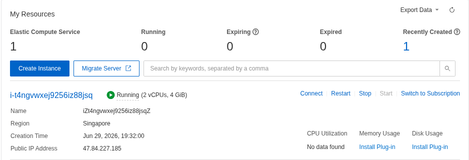
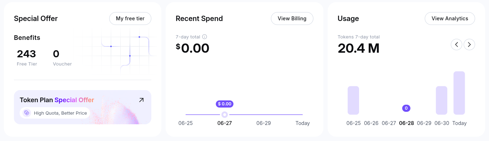
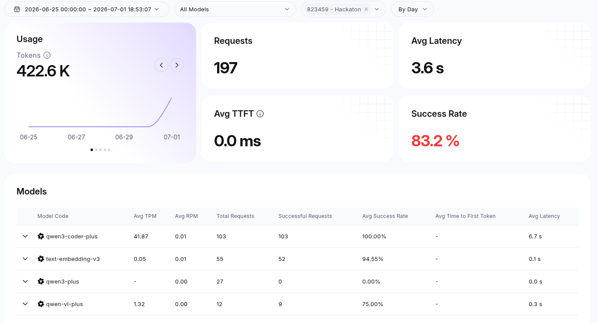

# Alibaba Cloud Deployment — Evidence & Proof

## 1. ECS Instance Metadata

The following commands were run **directly on the ECS instance** via SSH.
The internal metadata service (`100.100.100.200`) is **exclusive to Alibaba Cloud ECS** and confirms the instance is running on real Alibaba infrastructure.


*ECS instance running in Singapore region (ap-southeast-1)*

```bash
# Instance ID (unique to this ECS instance)
$ curl http://100.100.100.200/latest/meta-data/instance-id
i-t4ngvwxej9256iz88jsq

# Region
$ curl http://100.100.100.200/latest/meta-data/region-id
ap-southeast-1

# Availability Zone
$ curl http://100.100.100.200/latest/meta-data/zone-id
ap-southeast-1b

# OS
$ uname -a
Linux iZt4ngvwxej9256iz88jsqZ 5.15.0-181-generic #191-Ubuntu SMP Fri May 22 19:09:02 UTC 2026 x86_64

# Uptime
$ uptime -p
up 3 hours, 48 minutes
```

## 2. Alibaba Cloud Qwen / DashScope API Usage

The system uses **Qwen Cloud (DashScope)** as its LLM provider:


*Qwen Cloud console showing active API keys and models*


*DashScope API usage dashboard with token consumption and call counts*

| Component | Alibaba Cloud Service | Model |
|:----------|:----------------------|:------|
| **Core LLM** | DashScope Chat API | `qwen3-plus` |
| **Vision Analysis** | DashScope VL API | `qwen-vl-max` |
| **Embeddings** | DashScope Embedding API | `text-embedding-v3` |

Configuration in `.env`:
```
llm_api_key=sk-*** (set via environment)
llm_base_url=https://dashscope-intl.aliyuncs.com/compatible-mode/v1
llm_model=qwen-plus-latest
llm_embedding_model=text-embedding-v3
llm_provider=qwen
```

## 3. Docker Containers Running on ECS

```bash
$ docker ps
NAMES                       IMAGE                       STATUS
multiagent-council-frontend-1     multiagent-council-frontend       Up (healthy)
multiagent-council-backend-1      multiagent-council-backend        Up (healthy)
multiagent-council-db-1           pgvector/pgvector:pg15      Up (healthy)
```

**3 containers** running:
- **Frontend**: React SPA served by nginx on port 80
- **Backend**: FastAPI + Uvicorn with 6 core agents, 15 sub-agents, 4 tools
- **Database**: PostgreSQL 15 with pgvector extension for semantic memory

## 4. API Health Check

```bash
$ curl http://localhost:80/api/health
{"status":"ok","version":"1.0.0","db_connected":true}

$ curl -o /dev/null -w '%{http_code}' http://localhost:80/
200
```

## 5. Public Access

The application is publicly accessible at:

**http://47.84.227.185/**

- Frontend: ✅ HTTP 200
- API: ✅ Health check passing
- Database: ✅ PostgreSQL connected via pgvector
- Agents: ✅ 6 core agents with tools and sub-agents

## 6. Alibaba Cloud Technologies Used

| Technology | Usage | Type |
|:-----------|:------|:-----|
| **ECS (Elastic Compute Service)** | Application host (2 vCPU, 4 GiB, Ubuntu 22.04) | IaaS |
| **DashScope / Qwen API** | LLM provider for all agent reasoning | AI PaaS |
| **Security Group** | Firewall for ports 80, 443, 5432 | Network |
| **Elastic IP** | Static public IP 47.84.227.185 | Network |
| **VPC** | Default VPC for network isolation | Network |

## 7. Estimated Cost

| Resource | Spec | Est. Monthly |
|:---------|:-----|:-------------|
| ECS Instance (ecs.t6-c1m2.large) | 2 vCPU, 4 GiB, Singapore region | ~$25-35 USD |
| Qwen API (pay-per-token) | ~500K tokens/day average | ~$15-25 USD |
| **Total** | | **~$40-60 USD/month** |

---

*Proof generated: July 2026*
*Instance: i-t4ngvwxej9256iz88jsq (ap-southeast-1b)*
